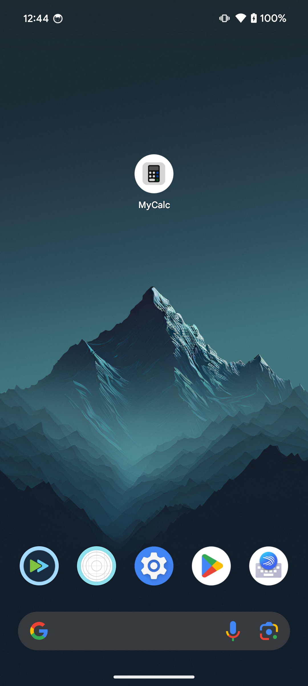
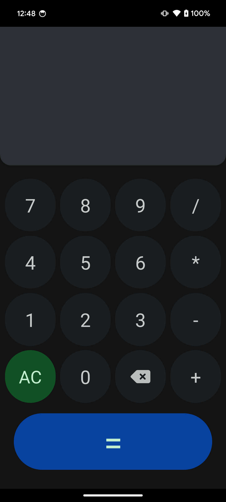
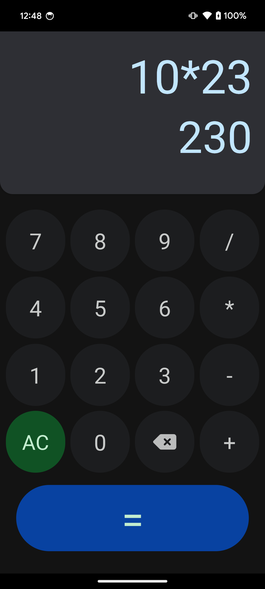

# **MyCalc**

MyCalc is a Google Calculator inspired simple Material Design Calculator that performs simple operations.

The app can be found at: [MyCalc Github Repo](https://github.com/Quadrified/uvx-calculator)

- App is created using `npx @react-native-community/cli`
- Uses `math.js` to evaluate expressions to display results.
- Utilizes [React Native Reanimated](https://docs.swmansion.com/react-native-reanimated/) to use simple animations for loading the display
- Has a custom app icon matching the color palette of the app
- Uses [react-native-vector-icons](https://github.com/oblador/react-native-vector-icons) for custom icons

## Screenshots
Screenshots are present in `assets/screenshots` folder if the following fail to load.

